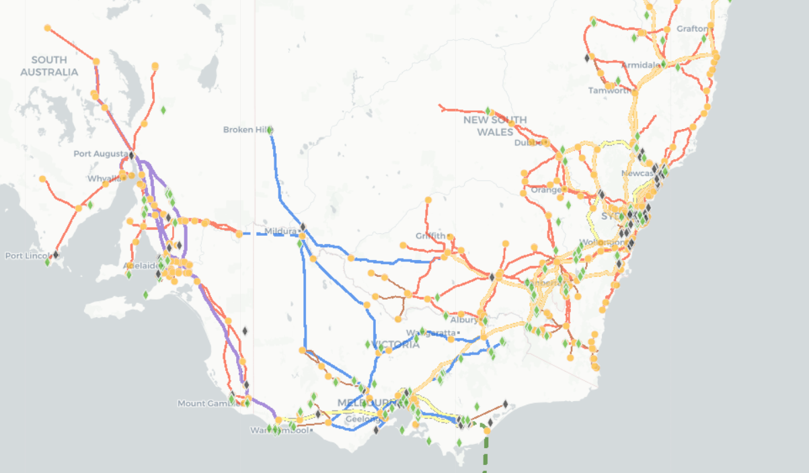
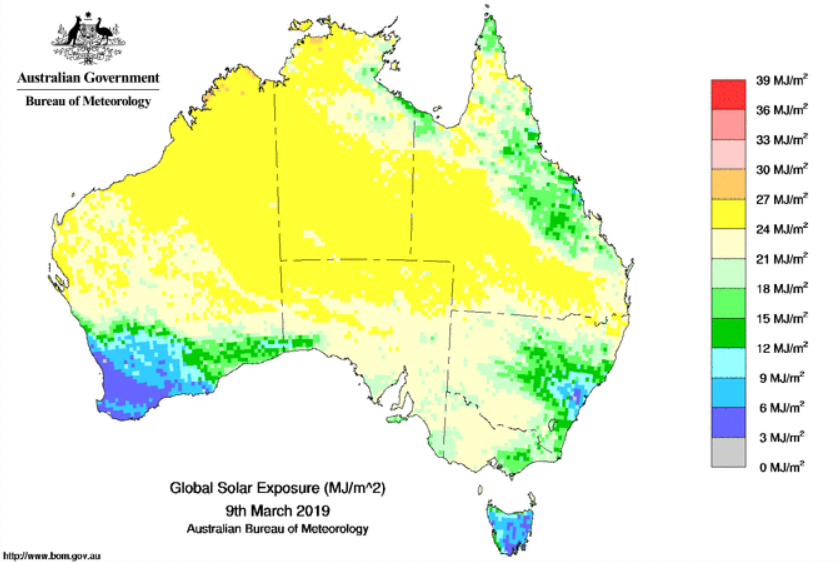
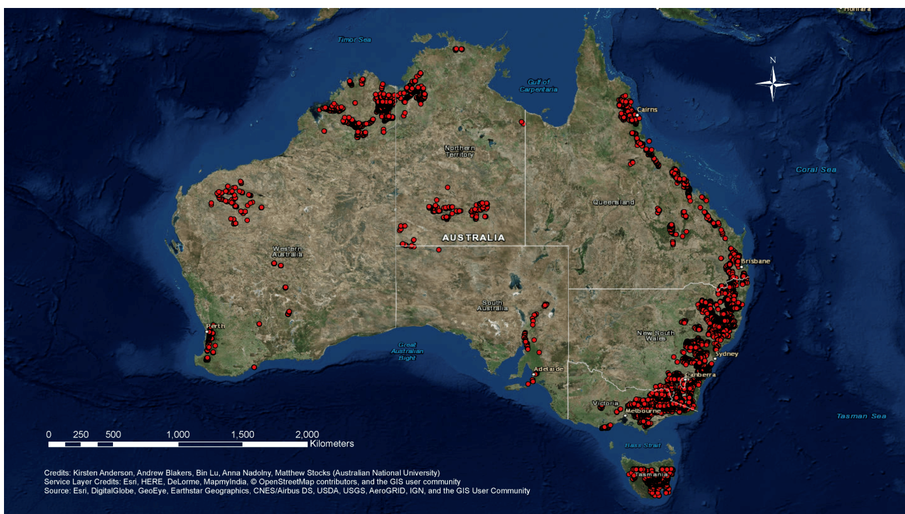
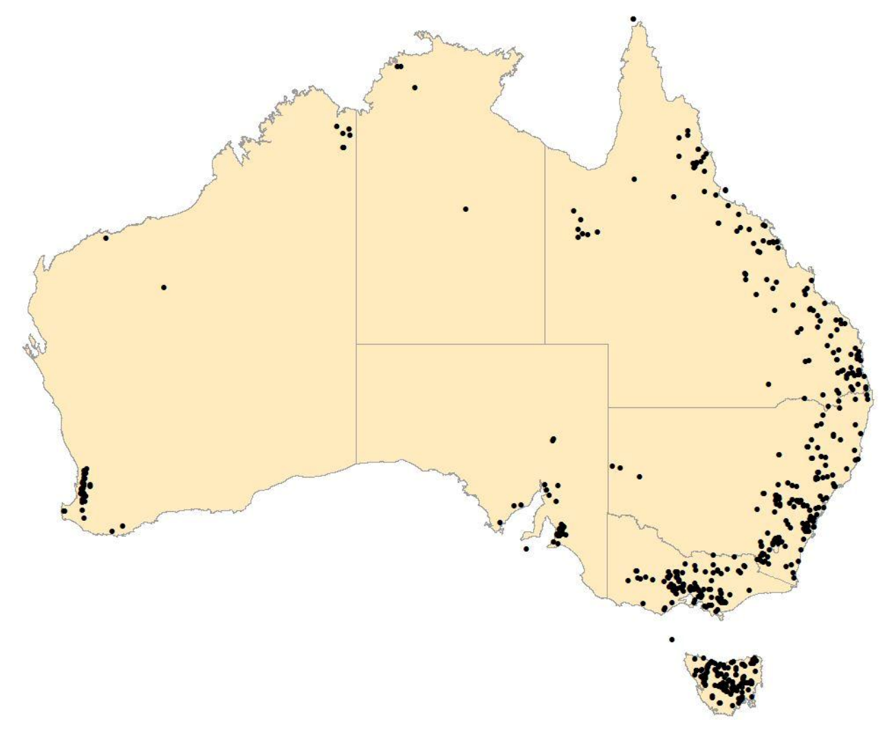

# Data
As our client requirment, backend team has search for public data availability 
and find the quality data source which is possible to use for data analysis and 
technicial development. The below data is our reserch outcome and some of them are 
sample data.

In addition, a suitable map API will be choose in the near future as it is crucial
for our web development

### 1. Electricity grid nodes and transmission lines ([ElectricityTransmissionLines_v2.xls](/ElectricityTransmissionLines_v2.xls))
Electricity grid nodes and transmission lines in Australia. It can be used to
find the distance to each users and calculate the potential cost to implement
renewable energy technologies. This is open data provided by GeoScience Australia.
(https://ecat.ga.gov.au/geonetwork/srv/eng/catalog.search#/metadata/83105)
# 

### 2. Solar Exposure [Monthly_solar_exposure_-ACT_070247.csv](/Monthly_solar_exposure_-ACT_070247.csv)
This is the sample data of monthly solar exposure in ACT Australian National Botanic 
Garden station no.070247. It can be used to find potential capacity for energy 
generation in different locations and even use machine learning to evaluate possible 
connections between energe usage and locations. However, the method to extract data 
from every stations is yet to be decide, therefore, this is only a display of 
sample data that can be very useful for machine learning operation. This is open
data provided by Bureau of Meteorology Australian Government. 
(http://www.bom.gov.au/climate/averages/climatology/gridded-data-info/gridded-climate-data.shtml)
# 

### 3. Potential pumped hydro energy storage (PHES)] [(ACT PHES sites.xlsx)](/ACT PHES sites.xlsx),
### [VIC PHSites.xlsx](/VIC PHSites.xlsx),[QLD PHSites.xlsx](/QLD PHSites.xlsx), 
### [WA PHSites.xlsx](/WA PHSites.xlsx), [TAS PHSites.xlsx](/TAS PHSites.xlsx), 
### [NT PHSites.xlsx](/NT PHSites.xlsx),[SA_PHES sites.xlsx](/SA_PHES sites.xlsx)
Potential pumped hydro energy storage (PHES) sites of different states within 
Australia by calculating the stored energy of pairs of dams with an altitudinal 
difference of more than 250m. This can be used as training data since it provides
the calculated energy based on parameters like water area, reservoir volume, 
average depth. So, we can use machine learning to study the training data and 
estimate for the other bodies of water, such as lake and other unknown reservoirs. 
This is open data provided by ANU College of Engineering & Computer Science. 
(http://re100.eng.anu.edu.au/research/phes/)
# 

### 4. [Dam Walls by GeoScience](/MajorDamWalls_v1.xls) 
This dataset presents the spatial locations of national major dam walls, 
in point and polygon format, of all known major dam walls within Australia. 
It can be used to determine the potential PHES sites with access to dam 
reservoirs according to the provided information such as wall height, 
wall length and so on. This is open data provided by GeoScience Australia. 
(https://ecat.ga.gov.au/geonetwork/srv/eng/catalog.search#/metadata/74783)
# 

### 5. [Dam by ANCOLD](/Dams-Australia-2010-v1.xls)
More than 500 of registered large dams within Australia. Same usage as the 
above major dam walls dataset, with additional parameters like dam volume and 
surface area, can be used as testing data to determine the potential stored 
energy. In addition, it can be used to merge with the above major dam walls 
in order to obtain a more reliable and accurate information. This is open data 
provided by Australian National Committee on Large Dams Incorporated (ANCOLD) 
Australia. (https://www.ancold.org.au/?page_id=4640 )

